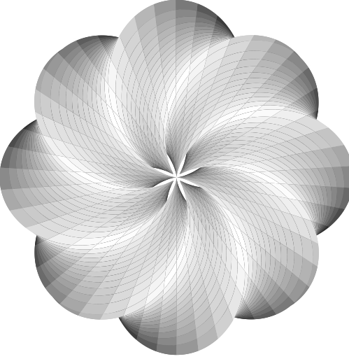
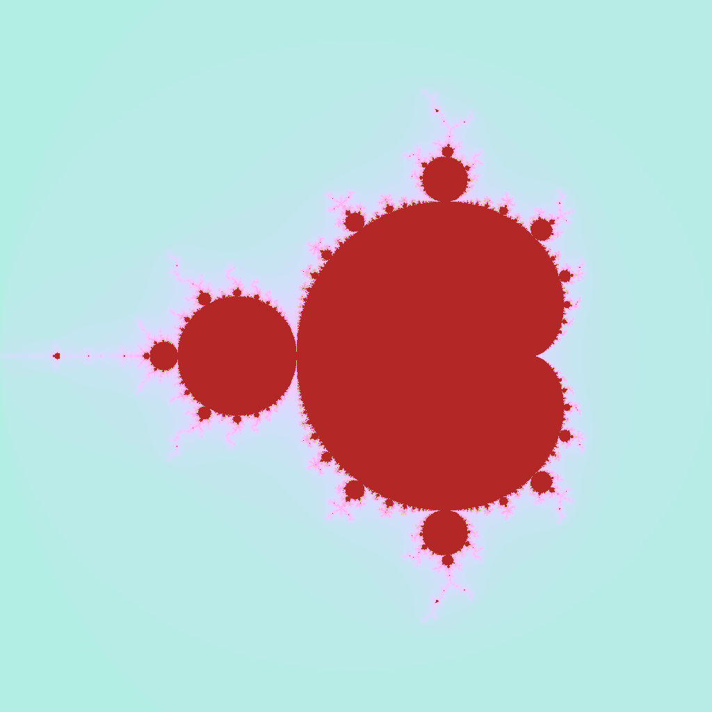
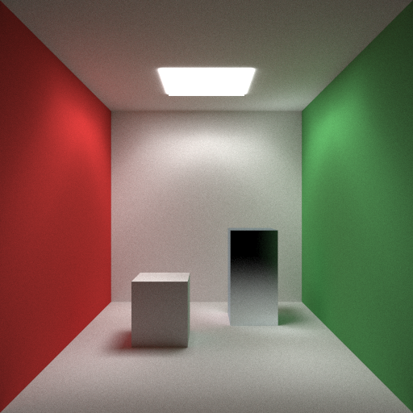

<div align="center">



# EasyGPU

Lightweight C++20 Embedded DSL for GPU Compute

This repo has been moved to [our organization](https://github.com/EasyGPU/EasyGPU) 

[](LICENSE)
[](https://en.cppreference.com/w/cpp/20)
[](https://www.opengl.org/)
[]()

[Getting Started](docs/getting-started.md) · [Tutorial](docs/tutorial.md) · [Examples](#examples) · [API Reference](docs/api-reference.md)

</div>

---

## Table of Contents

- [Overview](#overview)
- [Concept](#concept)
- [Features](#features)
- [Quick Start](#quick-start)
- [Examples](#examples)
- [Documentation](#documentation)
- [Building](#building)
- [License](#license)

---

## Overview

EasyGPU is an embedded domain-specific language (eDSL) for GPU programming that allows writing compute kernels in standard C++20. No shader language knowledge required.

```cpp
#include <GPU.h>

int main() {
    std::vector<float> data(1024, 2.0f);
    Buffer<float> input(data);
    Buffer<float> output(1024);

    Kernel1D square([](Int i) {
        auto in = input.Bind();
        auto out = output.Bind();
        out[i] = in[i] * in[i];
    });

    square.Dispatch(16, true);
    return 0;
}
```

### Who Is This For

**For beginners learning GPU programming:**
- Write GPU kernels using familiar C++ syntax instead of learning GLSL/HLSL
- No graphics programming background required — works with arrays, not just triangles
- Full IDE support: autocomplete, type checking, compile-time error detection
- 10 lines of code for your first working GPU kernel

**For experienced developers:**
- Zero vendor lock-in (OpenGL 4.3+, cross-platform)
- Minimal dependencies (only GLAD, ~500KB)
- Clean C++20 interface without heavy template metaprogramming

### Requirements

- C++20 compatible compiler (GCC 11+, Clang 14+, MSVC 2022+)
- OpenGL 4.3+
- CMake 3.21+ (optional)

---

## Concept

### The Problem

Traditional GPU programming requires maintaining two separate codebases:

```cpp
// CPU: C++
std::vector<float> data = {1, 2, 3, 4, 5};

// GPU: GLSL (separate language)
const char* shader = R"(
    #version 430 core
    layout(local_size_x = 256) in;
    layout(std430, binding = 0) buffer Data { float values[]; };
    void main() {
        uint idx = gl_GlobalInvocationID.x;
        values[idx] = values[idx] * values[idx];
    }
)";
```

Issues: language fragmentation, no IDE support, runtime error detection, string-based data passing.

### The Approach

EasyGPU unifies both sides in C++:

```cpp
// CPU and GPU: C++
std::vector<float> data = {1, 2, 3, 4, 5};
Buffer<float> input(data);
Buffer<float> output(data.size());

Kernel1D square([](Int i) {
    auto in = input.Bind();
    auto out = output.Bind();
    out[i] = in[i] * in[i];
});

square.Dispatch(16, true);
```

### Implementation

1. User writes C++ kernels using EasyGPU types
2. Library constructs an Intermediate Representation (IR)
3. IR is compiled to GLSL compute shaders
4. OpenGL executes on GPU

---

## Features

### Unified Language

Standard C++ syntax for GPU code. IDE features (autocomplete, refactoring, static analysis) work out of the box.

```cpp
Kernel1D sum([](Int i) {
    c[i] = a[i] + b[i];
});
```

### Control Flow

Structured control flow with C++-like semantics:

```cpp
If(x > 0, [&]() { 
    result = Sqrt(x); 
}).Else([&]() { 
    result = 0; 
});

For(0, 100, [&](Int& i) {
    If(i % 2 == 0) { Continue(); }
    Process(i);
});
```

### Memory Management

Automatic buffer alignment and struct layout:

```cpp
EASYGPU_STRUCT(Particle,
    (Float3, position),
    (Float3, velocity),
    (float, mass)
);

Buffer<Particle> particles(1000);
```

> **Important:** `EASYGPU_STRUCT` must be defined in the **global namespace**. Defining it inside any namespace will cause compilation errors.
> 
> ```cpp
> // Correct: global namespace
> EASYGPU_STRUCT(Particle, ...);
> 
> // Wrong: inside namespace
> namespace MyProject {
>     EASYGPU_STRUCT(Particle, ...);  // ERROR
> }
> ```

### Reusable Functions

```cpp
Callable<float(float)> square = [](Float x) {
    Return(x * x);
};

result = square(input);
```

### Introspection

```cpp
// Inspect generated GLSL
std::cout << kernel.GetGeneratedGLSL() << std::endl;

// Profile execution
KernelProfiler::PrintReport(kernel);
```

---

## Quick Start

### Installation

**CMake FetchContent:**

```cmake
include(FetchContent)
FetchContent_Declare(
    easygpu
    GIT_REPOSITORY https://github.com/easygpu/EasyGPU.git
    GIT_TAG v0.1.0
)
FetchContent_MakeAvailable(easygpu)
target_link_libraries(your_target EasyGPU)
```

**Manual:** Copy `include/` to your project and link against OpenGL.

### First Program

```cpp
#include <GPU.h>
#include <iostream>
#include <vector>

int main() {
    std::vector<float> numbers = {1, 2, 3, 4, 5};
    
    Buffer<float> gpu_input(numbers);
    Buffer<float> gpu_output(numbers.size());
    
    Kernel1D double_values([&](Int i) {
        auto input = gpu_input.Bind();
        auto output = gpu_output.Bind();
        output[i] = input[i] * 2.0f;
    });
    
    double_values.Dispatch(1, true);
    gpu_output.Download(numbers);
    
    for (float n : numbers) {
        std::cout << n << " ";
    }
    
    return 0;
}
```

> ⚠️ **Important: Variable Initialization**
> 
> Always use `Make*()` functions when initializing variables from buffer elements:
> ```cpp
> // ✅ CORRECT: Creates a new independent variable
> Int val = MakeInt(input[i]);
> val = 5;  // Only modifies val
> 
> // ❌ DANGEROUS: May create a reference to input[i]
> Int val = input[i];
> val = 5;  // May unexpectedly modify input[i]!
> ```
> See [Tutorial](docs/tutorial.md) for details.

Build:

```bash
g++ -std=c++20 hello_gpu.cpp -lEasyGPU -lGL -o hello_gpu
./hello_gpu
```

---

## Examples

| Level | Example | Topics |
|:------|:--------|:-------|
| Beginner | [hello_world](examples/hello_world/main.cpp) | Buffers, kernels |
| Beginner | [mandelbrot](examples/mandelbrot/main.cpp) | 2D kernels, math |
| Intermediate | [julia_set](examples/julia_set/main.cpp) | Complex numbers |
| Intermediate | [ray_tracing](examples/ray_tracing/main.cpp) | Structs, RNG, basic ray tracing |
| Advanced | [sdf_renderer](examples/sdf_renderer/main.cpp) | Callables, SDF, path tracing |

### Mandelbrot Set

```cpp
Kernel2D mandelbrot([&](Int px, Int py) {
    Float x = CENTER_X + (Float(px) / WIDTH - 0.5f) * ZOOM;
    Float y = CENTER_Y + (Float(py) / HEIGHT - 0.5f) * ZOOM;
    
    Float zx = 0, zy = 0;
    Int iter = 0;
    
    For(0, MAX_ITER, [&](Int i) {
        If(zx*zx + zy*zy > 4.0f) {
            iter = i;
            Break();
        };
        Float new_zx = zx*zx - zy*zy + x;
        zy = 2.0f*zx*zy + y;
        zx = new_zx;
    });
    
    image[py * WIDTH + px] = ColorFromIteration(iter);
});

mandelbrot.Dispatch(WIDTH/16, HEIGHT/16);
```



[View full example →](examples/mandelbrot/main.cpp)

### Ray Tracing



Basic Monte Carlo ray tracer demonstrating struct handling and random number generation.

[View full example →](examples/ray_tracing/main.cpp)

### SDF Path Tracer


Signed distance field path tracer with support for complex lighting and materials. Demonstrates advanced Callable usage and reusable kernel functions.

[View full example →](examples/sdf_renderer/main.cpp)

---

## Best Practices

### Variable Initialization

**Always use `Make*()` functions** when creating GPU variables from buffer elements or expressions:

```cpp
auto buf = buffer.Bind();

// ✅ CORRECT: Explicitly create a new independent variable
Int val = MakeInt(buf[i]);
Float f = MakeFloat(buf[i] * 2.0f);
val = 5;  // Only modifies val, NOT buf[i]

// ❌ DANGEROUS: Direct initialization may create a reference
Int val = buf[i];  // val may become an alias to buf[i]!
val = 5;  // May unexpectedly modify buf[i] in the generated shader
```

**Why this matters:** Due to move constructor optimizations, `Int val = buf[i]` transfers ownership of the underlying variable name, causing `val` to reference `buffer[i]` directly. Use `Make*()` to ensure value semantics and create truly independent variables.

## Documentation

- [Getting Started](docs/getting-started.md)
- [Tutorial](docs/tutorial.md)
- [API Reference](docs/api-reference.md)
- [Common Patterns](docs/patterns.md)
- [FAQ](docs/faq.md)

---

## Building

### Dependencies

| Dependency | Required | Size | Purpose |
|:-----------|:---------|:-----|:--------|
| OpenGL 4.3+ | Yes | System | Compute backend |
| GLAD | Yes | ~500KB (bundled) | OpenGL loader |
| stb_image | No | ~50KB (examples only) | Image I/O |

### Build Commands

```bash
git clone --recursive https://github.com/easygpu/EasyGPU.git
cd EasyGPU

cmake -B build -DCMAKE_BUILD_TYPE=Release
cmake --build build -j

cd build && ctest
```

### CMake Options

| Option | Default | Description |
|:-------|:--------|:------------|
| `EASYGPU_BUILD_EXAMPLES` | `ON` | Build examples |
| `EASYGPU_BUILD_TESTS` | `ON` | Build tests |

---

## License

MIT License. See [LICENSE](LICENSE).

---

## Acknowledgements

- [LuisaCompute](https://github.com/LuisaGroup/LuisaCompute) — DSL design
- [Taichi](https://github.com/taichi-dev/taichi) — Algorithms
- [GLAD](https://glad.dav1d.de/) — OpenGL loader
- [stb](https://github.com/nothings/stb) — Image utilities

---

<div align="center">

[Back to Top](#easygpu)

</div>
